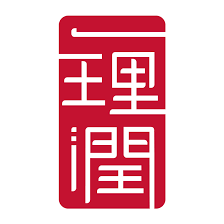
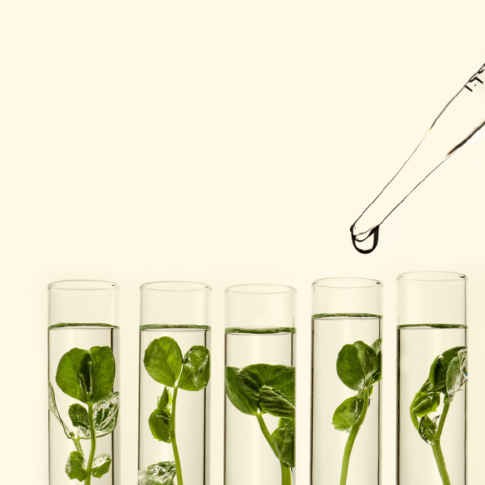
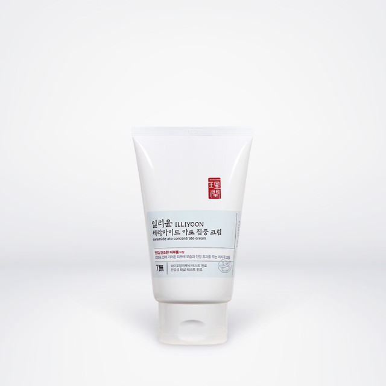
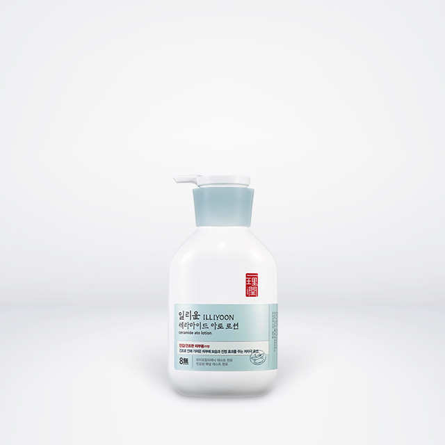
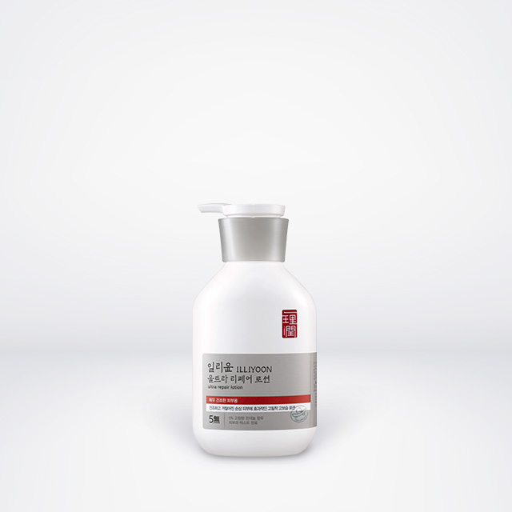

아시아의 좋은 원료에서 찾은 피부과학으로 피부 본연의 건강함(潤)을 되찾아주는 보습 전문 브랜드입니다.

일리윤은 민감하고 건조한 피부를 가진 고객에게 순하면서 강한 보습 효과를 제공합니다. 한국의 헤리티지 성분에 아모레퍼시픽의 피부 과학 기술을 담아, 피부 표면이 아닌 피부 장벽부터 강화시켜 피부 스스로 촉촉함을 유지할 수 있도록 자습력(自濕力)을 키워줍니다. 하이포알러지, 민감성 패널 테스트를 거친 무향/미향의 마일드한 포뮬러가 선사하는 순하고 강력한 보습의 힘을 경험해보세요.

## Ingredients
### 윤 콤플렉스&trade;
고서의 '생형윤부음'이라는 윤부(潤膚), 즉 피부를 윤하게 하는 처방에서 찾은 인삼수, 일당귀, 맥문동 등의 약재들을 현대적으로 해석하여 담아낸, 일리윤의 핵심 성분 입니다.

## Technologies
### 세라마이드 캡슐화 기술
세라마이드 아토 집중크림에 함유된 세라마이드 스킨 콤플레스&trade;는 아모레퍼시픽과 에스트라가 공동 개발한 특허 성분으로, 세계 최초 세라마이드 캡슐화 기술 입니다.
피부 장벽을 구성하는 세라마이드를 캡슐화하여, 유효 성분을 효율적으로 전달하고 흡수시켜 줍니다.

## Icon Products
### 세라마이드 아토 집중크림
피부 장벽을 구성하는 세라마이드 성분을 캡슐에 담아 예민한 피부에 즉각적으로 보습/진정 효과를 주는 저자극 크림

### 세라마이드 아토 로션
건조함으로 인해 가렵고 민감해진 피부를 산뜻하고 촉촉하게 만들어주는 저자극 데일리 보습 로션

### 울트라리페어 인텐스 로션
피부 깊숙이 촘촘하게 차오르는 보습력으로 하루 종일 촉촉하고 당김 없이 편안한 피부로 개선해주는 고 밀착 고보습 로션 (고용량 판테놀 함유)

